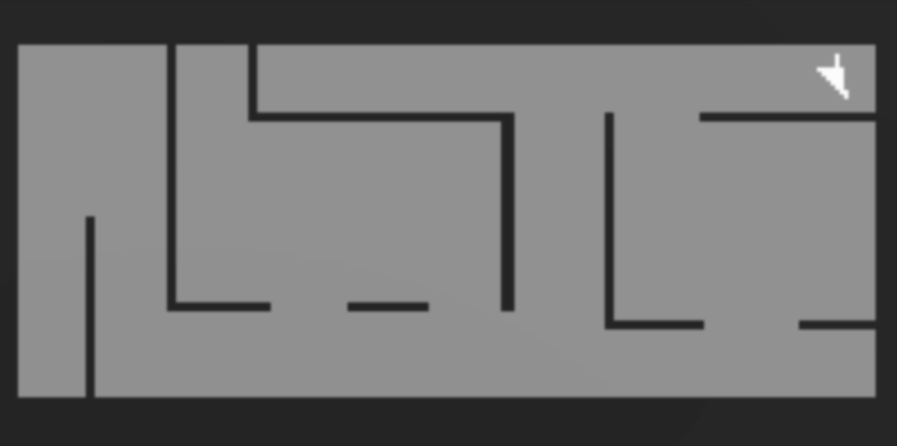

# UNITY ML AGENTS TEST LEVELS

This repository provides a set of environments created using [Unity ML Agents](https://unity-technologies.github.io/ml-agents/), suitable for Meta Reinforcement Learning.

[Unity ML Agents](https://unity-technologies.github.io/ml-agents/) is a versatile tool for creating environments in the Unity engine and providing a convenient interface for interaction with Python. However, at the moment, there is a lack of environments for meta reinforcement learning available in the open access.
For this reason, I decided to make my developments publicly available.

## RETURNING FORMAT

The environment state is described by 3 components: the local environment, the target map, and numerical data (THE LAST 2 ARE NEEDED FOR DEBUGGING!). Let's discuss them in detail:

The local observation - a detailed image of all objects around the agent with dimensions of 142x142.

  

The goal map - defines the locations of targets and obstacles. An image with 3 channels: the first channel shows the position of the agent on the level and obstacles. All 3 have the same size of 166x166.

  

The second and third channels show the positions of the targets. Here, the color is scaled according to the number of points obtained for completing the target. Since there are 2 types of targets (destroying enemies and reaching zones), there is a separate channel for each of them.

  

The last component is a vector of numerical data with a dimension of 7. The components correspond to the following values: Number of enemies (in the agent's local environment), number of score zones (in the agent's local environment), number of frames since simulation launch, reward value, initial number of enemies in the level, initial number of score zones, number of bullets fired.

For any questions, please contact me @beg1488.
